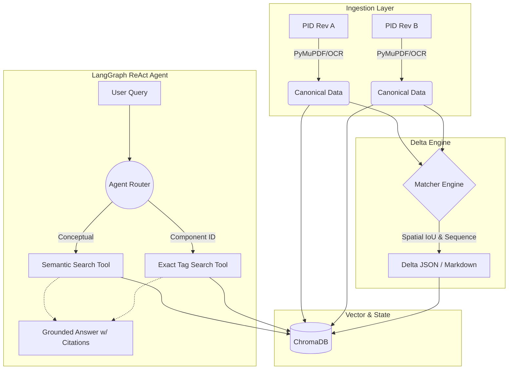

# PID Delta & RAG Chat

An advanced pipeline for engineering document analysis, specifically designed to compute structural differences between two revisions of Piping & Instrumentation Diagrams (P&IDs) and expose those differences via a grounded, citation-backed chat interface.

## Core Features

- **Document Ingestion**: Parses Native PDFs, Scanned PDFs (via OCR), and CAD files (DWG/DXF) into a unified, format-agnostic canonical representation.
- **Delta Engine**: Computes highly accurate deltas (additions, deletions, modifications) between two document revisions. It utilizes a combination of sequence matching and spatial intersection-over-union (IoU) to reliably track components even when text is shifted.
- **Grounded ReAct Chat**: An intelligent query layer powered by a LangGraph ReAct agent. It strictly grounds all answers in the source documents and delta report, preventing hallucinations.
- **Dynamic Tool Calling**: The chat interface automatically routes queries using semantic vector search for general conceptual questions, or an exact tag-matching tool when querying specific engineering components (e.g., valves, line numbers, or dimensions).
- **Inline Citations**: Every factual claim is backed by an exact citation to a specific page and block ID, ensuring full traceability.

## Architecture Highlights

The system is built with a 4-layer architecture:
1. **Adapters**: Handles parsing and spatial bounding box extraction (PyMuPDF, pytesseract, ezdxf).
2. **Delta Matcher**: Aligns text blocks spatially and structurally to compute the delta.
3. **Vector Store**: Indexes both the source documents and the computed delta items into ChromaDB.
4. **Agent Layer**: Orchestrates tool selection and manages conversational state using LangGraph.



## 🤖 Agent-Based Chat & Tools Approach

Rather than relying on a naive RAG pipeline that blindly retrieves nearest neighbors, this project implements an autonomous **LangGraph ReAct (Reasoning and Acting) Agent**. The agent dynamically plans its retrieval strategy using the following custom tools:
- **`semantic_search`**: Utilizes dense vector embeddings to perform fuzzy conceptual searches. It is highly effective for abstract questions like *"Why are straight pipe runs required?"* or *"What are the safety margins?"*
- **`exact_tag_search`**: Bypasses vector approximation to perform high-precision substring matching on ChromaDB metadata. When an engineer queries a specific component (e.g., *"What changed on valve 26-KA-902?"*), the agent routes to this tool to guarantee zero hallucination on critical engineering IDs.

By dynamically injecting the Delta Report summary into the Agent's state prompt, it maintains global context of the changes (e.g., total modifications vs deletions) while retrieving granular details on demand.

## 📊 Observability & Telemetry

The system ships with enterprise-grade observability (found in `src/observability/`):
- **Structured Tracing**: Every request logs a detailed JSON trace to the `traces/` directory, capturing end-to-end execution.
- **Stage Metrics**: Granular latency timing for Ingestion, Delta computation, Vector Retrieval, and LLM Generation.
- **LLM Telemetry**: Tracks prompt tokens, completion tokens, model details, and estimated USD cost per query.
- **Error Visibility**: Any pipeline failures (e.g., OCR limits, LLM timeouts) are gracefully caught and appended to the request trace.

## 🧪 Evaluation Harness

An automated evaluation harness is provided in the `eval/` directory to scientifically measure system improvements:
- **Delta Scorecard**: Computes Precision, Recall, and F1-Score for the detected changes against a human-labeled `ground_truth.json`.
- **Chat Groundedness**: Uses a combination of heuristic checks and LLM-as-a-judge to evaluate if the agent's answers are factually correct and properly cited.
- **Run the Eval**: Simply execute `make eval` to generate the console scorecard and identify regressions.

## Setup and Installation

### Requirements
- Python 3.10+
- Tesseract OCR (for scanned documents)

### Installation

1. Clone the repository:
```bash
git clone https://github.com/Raja904/pid-delta-rag.git
cd pid-delta-rag
```

2. Set up a virtual environment:
```bash
python -m venv .venv
source .venv/bin/activate  # On Windows: .venv\Scripts\activate
```

3. Install dependencies:
```bash
pip install -r requirements.txt
```

4. Configure Environment Variables:
Copy `.env.example` to `.env` and fill in your API keys.
```bash
cp .env.example .env
```

## Usage

Start the Streamlit application:
```bash
python -m streamlit run app.py
```

1. **Run Delta Analysis**: Upload or select your base (Rev A) and revised (Rev B) documents to generate the delta report.
2. **Explore the Chat**: Ask targeted questions like:
   - *"What changed on tag 43BL9019?"*
   - *"Did the dimensions for the suction strainer change?"*
   - *"How many total modifications were made?"*

The agent will seamlessly traverse the documents and delta report to provide a cited answer.
